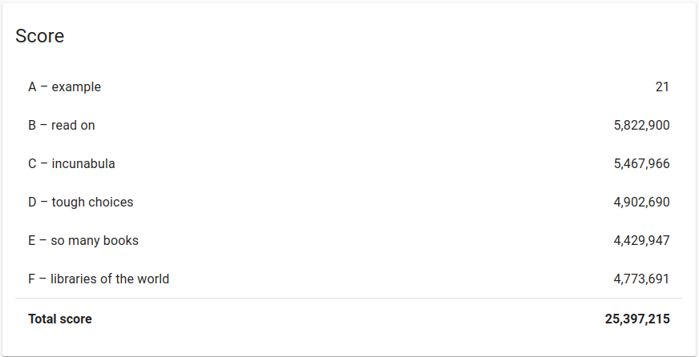

# GoogleHashCode2020 - Extended Round

## Results
Our implementation was submitted on the extended round, achieving a total score of 25,397,215 (best score was 27,211,866)

## Algorithm
There are 2 algorithms provided (the second one runs by default). On both of them, the main idea is to sort the libraries and
their books in the best possible way, taking into consideration the books score, duplicate books, sign up days needed and number
of books that each library has. Those with the better combination (primarily books score), insert first into the system.

## Install - Run
1. Compile: `make`
2. Execute: `./hashcode_solution -i ./datasets/a_example.txt <more input files paths>`

- Results on datasets folder (.out files)

## Contributors
- [Vangelis Garaganis](https://github.com/VangelisGara)
- [Kostas Kotronis](https://github.com/KostasKotronis)
- [Orestis Garmpis](https://github.com/ogarmpis)
